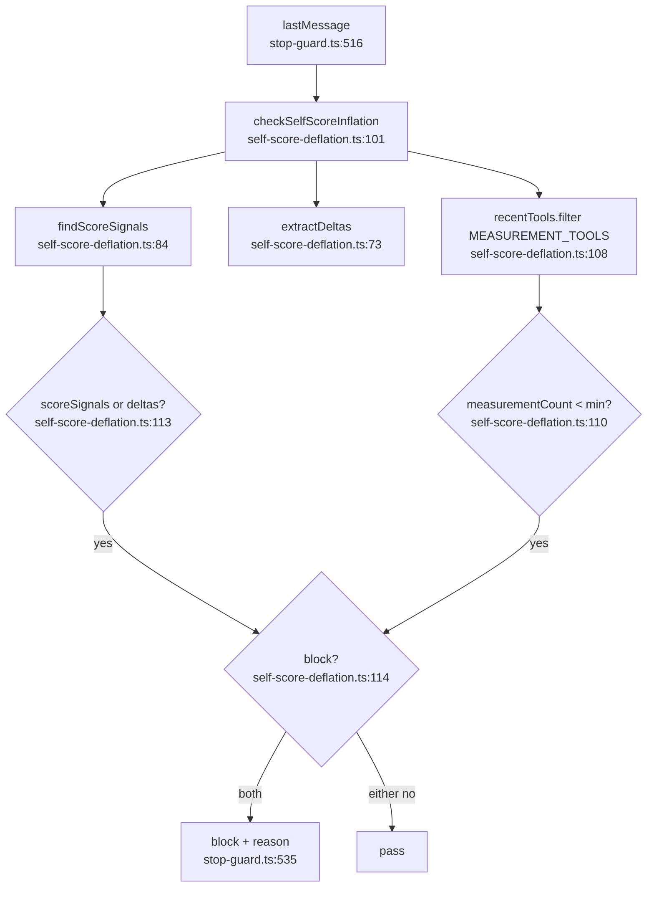

# F1: self-score-inflation

**Regex source**: `SELF_SCORE_PATTERNS` lines 47-55. Last pattern `\b\d+\s*\/\s*(10|100)\b` — **컨텍스트 미검사**.

**측정 도구 세트**: `MEASUREMENT_TOOLS = Set(['Bash', 'NotebookEdit'])` (line 32-34).

**External deps**: `stop-guard.ts:534` 호출, `loadRecentToolNames` 입력.
