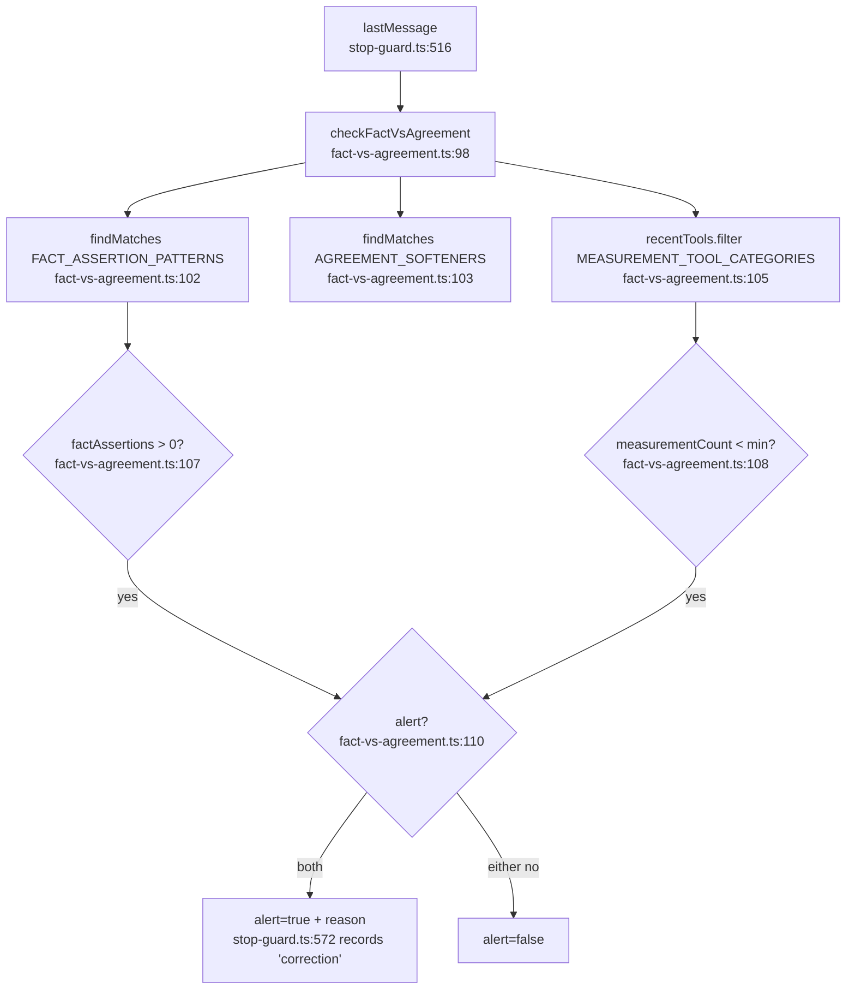

# F2: fact-vs-agreement

**Regex source**: `FACT_ASSERTION_PATTERNS` 32-43, `AGREEMENT_SOFTENERS` 46-52.

**측정 도구 세트**: `MEASUREMENT_TOOL_CATEGORIES = Set(['Bash', 'NotebookEdit'])` (line 26-29) — **F1과 정확히 동일한 Set**, 변수명만 다름.

**External deps**: `stop-guard.ts:572` 호출. design intent는 alert-only 인데 현재 wiring은 `kind:'correction'`로 violations.jsonl 기록만.
