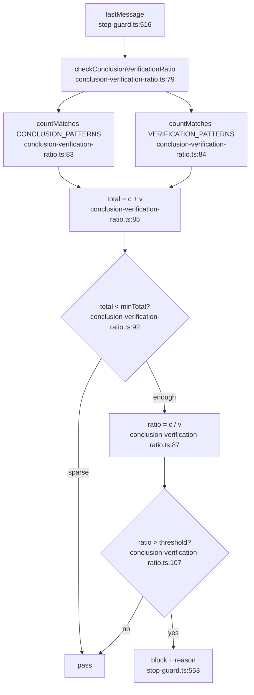

# F3: conclusion-verification-ratio

**Regex source**: `CONCLUSION_PATTERNS` 19-30, `VERIFICATION_PATTERNS` 33-46.

**측정 도구 세트 미사용** — 텍스트 내부 카운트만 사용. recentTools 무관.

**External deps**: `stop-guard.ts:552` 호출.
