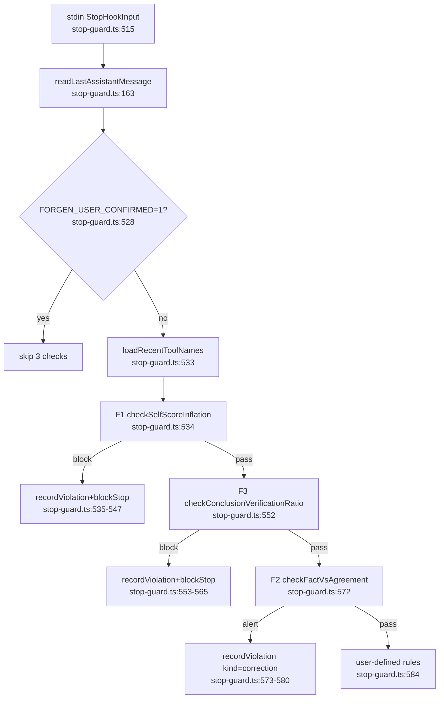

# F4: stop-guard orchestration

**중복 wiring 패턴**: 3 check 모두 동일한 5-단계 보일러플레이트
1. `checkXxx({text: lastMessage, ...})`
2. `if (result.block / alert)`
3. `recordViolation({rule_id, session_id, source, kind, message_preview})`
4. `reasonText = '[forgen:stop-guard/...] ${result.reason}\n\n(Override...)'`
5. `console.log(blockStop(reasonText, 'rule:TEST-X — ...'))`

각 체크가 동일한 reason format / override hint / violation record shape를 따로 손코딩.
