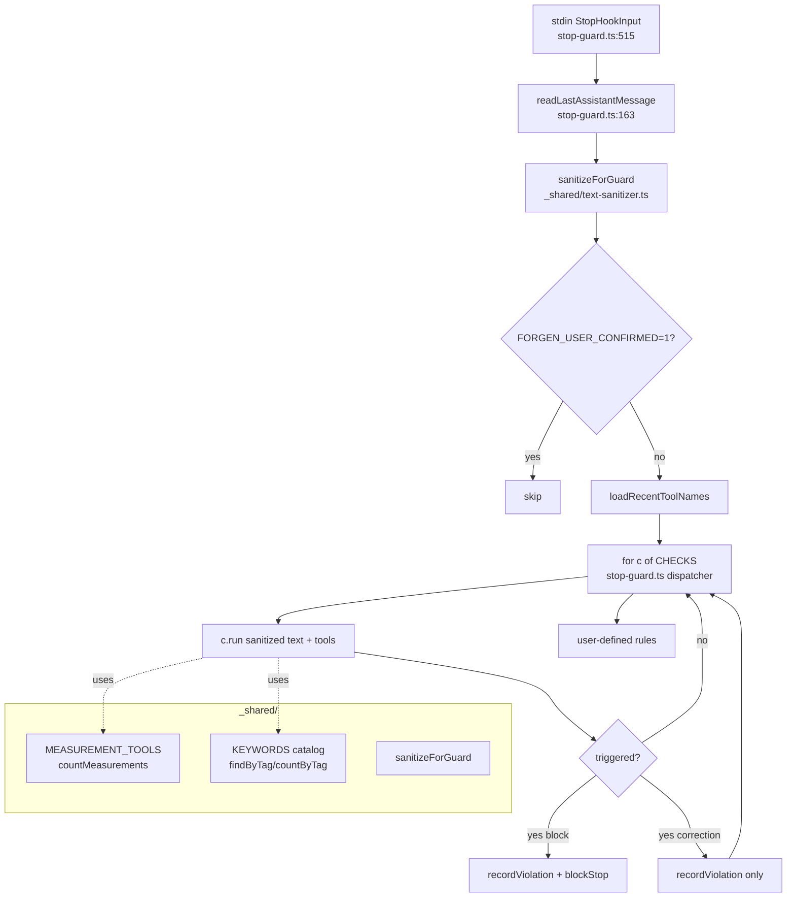

# Unified Proposal

## 핵심 결정

D1, D2, D3, D4, D5, D6, D7 — 일곱 중복은 모두 **두 개의 단일 모듈**로 흡수됨:

1. `src/checks/_shared/text-sanitizer.ts` — D4, D5 흡수 (구조출력 면제 + 인용 컨텍스트 stripping)
2. `src/checks/_shared/measurement.ts` — D1, D2 흡수 (측정 도구 세트 + counter)
3. `src/checks/_shared/keyword-catalog.ts` — D3, D6 흡수 (키워드 카탈로그 + matcher)
4. `src/hooks/stop-guard.ts:528-582` 리팩토링 — D7 흡수 (체크 디스패처)

3개 체크 자체(F1/F2/F3)는 **유지**. 각자 다른 판정 의미(점수 인플레이션 / 사실 대 합의 / 비율)가 있으므로 통합 대상 아님 — 이건 legitimate specialization. 통합 대상은 그것들이 공유하는 **infrastructure**.

---

## 1. text-sanitizer.ts (NEW, ~50 LOC)

**목적**: stop-guard에 들어오는 `lastMessage`를 체크 적용 전에 정화.

```ts
// src/checks/_shared/text-sanitizer.ts
const STRUCTURED_TAGS = ['observation', 'summary', 'request', 'investigated', 'completed', 'next-steps', 'title', 'subtitle'];

export function sanitizeForGuard(raw: string): string {
  let s = raw;
  // 1) structured-output 블록 제거 (observer/skill 산출)
  for (const tag of STRUCTURED_TAGS) {
    const re = new RegExp(`<${tag}[^>]*>[\\s\\S]*?<\\/${tag}>`, 'gi');
    s = s.replace(re, '');
  }
  // 2) inline code/quoted literals 제거 (self-paradox 방지)
  s = s.replace(/`[^`\n]*`/g, ''); // backtick code
  s = s.replace(/```[\s\S]*?```/g, ''); // fenced code
  s = s.replace(/"[^"\n]{0,40}"/g, ''); // 짧은 직인용
  return s;
}
```

**효과**:
- D4 해결: observer XML 본문은 체크 입력 전에 사라짐 → FP 18건/36 → 0
- D5 해결: 인용된 `"4/10"`, `"verified"` 같은 self-reference 매칭 차단 → 메타 대화 가능
- 단일 진입점: 모든 체크가 `sanitizeForGuard(lastMessage)`로 시작

**손실**:
- structured tag 안에 진짜 인플레이션 점수가 들어있을 경우 놓침. 다만 observer는 *과거 사실 기록*이지 자기 평가가 아니므로 의도된 면제.

---

## 2. measurement.ts (NEW, ~15 LOC)

```ts
// src/checks/_shared/measurement.ts
export const MEASUREMENT_TOOLS = new Set(['Bash', 'NotebookEdit']);

export function countMeasurements(recentTools: string[]): number {
  return recentTools.filter((t) => MEASUREMENT_TOOLS.has(t)).length;
}

export function hasEnoughMeasurements(recentTools: string[], min = 1): boolean {
  return countMeasurements(recentTools) >= min;
}
```

**old → new**:
- `self-score-deflation.ts:32-34, 108` → `import { MEASUREMENT_TOOLS, countMeasurements }`
- `fact-vs-agreement.ts:26-29, 105` → `import { MEASUREMENT_TOOLS, countMeasurements }`

**효과**: D1, D2 흡수. 측정 도구 기준이 바뀔 때 한 곳만 수정.

**손실**: 없음.

---

## 3. keyword-catalog.ts (NEW, ~80 LOC)

```ts
// src/checks/_shared/keyword-catalog.ts
type KeywordTag = 'fact' | 'conclusion' | 'verification' | 'softener' | 'score-inflation';

export const KEYWORDS: { tag: KeywordTag; pattern: RegExp; lang: 'en' | 'ko' }[] = [
  // fact + conclusion 공통
  { tag: 'fact', pattern: /\b(pass(es|ed)?|passing)\b/i, lang: 'en' },
  { tag: 'fact', pattern: /\bverified\b/i, lang: 'en' },
  // ... (D3 통합)
  // conclusion only
  { tag: 'conclusion', pattern: /\b(done|ready|shipped|finished|complete)\b/gi, lang: 'en' },
  { tag: 'conclusion', pattern: /\bLGTM\b/g, lang: 'en' },
  // verification
  { tag: 'verification', pattern: /\b(test(s|ed|ing)?|tested)\b/gi, lang: 'en' },
  // ...
];

export function findByTag(text: string, tag: KeywordTag, max = 3): string[] { /* unified findMatches */ }
export function countByTag(text: string, tag: KeywordTag): number { /* unified count */ }
```

**old → new**:
- `fact-vs-agreement.ts FACT_ASSERTION_PATTERNS` → `findByTag(text, 'fact')`
- `conclusion-verification-ratio.ts CONCLUSION_PATTERNS` → `countByTag(text, 'conclusion')` + `countByTag(text, 'fact')` 통합 (conclusion = fact ∪ shipping verbs)
- `findScoreSignals` / `findMatches` 두 helper → `findByTag` 단일

**효과**: D3, D6 흡수. 키워드 한 카탈로그 = 한 곳에서 어휘 진화.

**손실**: 없음. 분류 태그로 명확해짐.

---

## 4. stop-guard.ts 디스패처 (리팩토링)

```ts
// src/hooks/stop-guard.ts (528-582 대체)
type GuardCheck = {
  id: string;
  shortId: string;
  ruleSlug: string;
  run: (text: string, recentTools: string[]) => { triggered: boolean; reason: string; kind: 'block' | 'correction' };
};

const CHECKS: GuardCheck[] = [
  { id: 'TEST-2', shortId: 'self-score-inflation', ruleSlug: 'rule:TEST-2 — self-score inflation',
    run: (t, r) => { const x = checkSelfScoreInflation({text: t, recentTools: r}); return { triggered: x.block, reason: x.reason, kind: 'block' }; } },
  { id: 'TEST-3', shortId: 'conclusion-ratio', ruleSlug: 'rule:TEST-3 — conclusion/verification ratio',
    run: (t, r) => { const x = checkConclusionVerificationRatio({text: t}); return { triggered: x.block, reason: x.reason, kind: 'block' }; } },
  { id: 'TEST-1', shortId: 'fact-vs-agreement', ruleSlug: 'rule:TEST-1 — fact vs agreement',
    run: (t, r) => { const x = checkFactVsAgreement({text: t, recentTools: r, minMeasurements: 1}); return { triggered: x.alert, reason: x.reason, kind: 'correction' }; } },
];

if (process.env.FORGEN_USER_CONFIRMED !== '1') {
  const sanitized = sanitizeForGuard(lastMessage);
  const recentTools = loadRecentToolNames(sessionId);
  for (const c of CHECKS) {
    const r = c.run(sanitized, recentTools);
    if (!r.triggered) continue;
    recordViolation({ rule_id: `builtin:${c.shortId}`, session_id: sessionId, source: 'stop-guard', kind: r.kind, message_preview: lastMessage.slice(0, 120) });
    if (r.kind === 'block') {
      console.log(blockStop(`[forgen:stop-guard/${c.shortId}] ${r.reason}\n\n(Override this turn: set FORGEN_USER_CONFIRMED=1 (audited).)`, c.ruleSlug));
      return;
    }
  }
}
```

**효과**: D7 흡수. 새 체크 추가 = `CHECKS` 배열 한 항목. 보일러플레이트 ~30 LOC 감소. sanitizer 호출이 자동으로 모든 체크에 적용.

**손실**: 없음. 단 첫 호출의 sanitization이 모든 체크에 일괄 적용 — F3는 sparse text minTotal=4 임계가 sanitization 후 더 자주 sparse로 판정될 수 있음 (보수적 fallback이라 안전).

---

## 통합 후 Mermaid



---

## 거부된 안티패턴

- ❌ "Plugin registry로 체크 자동 등록" — 3개를 하드코딩 배열로 충분. registry 도입은 over-engineering.
- ❌ "체크별 sanitizer 옵션 노출" — 모든 체크가 동일 정책 필요. 옵션화 = drift 입구.
- ❌ "feature flag로 sanitizer 점진 도입" — sanitizer가 정확히 false positive 해결 도구이므로 즉시 적용. 플래그는 책임 회피.
- ❌ "F2를 F3로 흡수" — 두 체크는 다른 의미 (도구 호출 신호 vs 텍스트 비율). specialization 보존.
